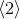
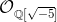
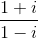
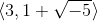
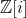

QiPy
====================

QiPy is a Python library to work with `quadratic integers`_. Well-known examples
are `Gaussian integers`_ and `Eisenstein integers`_. Besides,
QiPy implements ideals, `ideal classes`_ and `class groups`_ of
quadratic integer rings.

This library has been exhaustively tested with unit tests and `property testing`_.

A complete documentation of QiPy, including examples of all its funcionalities,
can be found in the `GitHub Page`_ of the repository.

Installation
~~~~~~~~~~~~

QiPy is written in Python 3 and uses the Python library SymPy_. Therefore,
Python 3 and SymPy must be installed in your computer.

The easiest way to install QiPy is with pip_ : ::

    pip3 install qipy

Examples of usage
~~~~~~~~~~~~~~~~~

Computing |frac| in |Zi|:

    >>> Zi = QuadraticIntegerRing(-1)
    >>> Zi("1 + I") / Zi("1 - I")
    I

Factoring |2| in |Zi|:

    >>> Zi = QuadraticIntegerRing(-1)
    >>> Zi(2).factor()
    [1 + I, 1 - I]

Testing whether the ideal |twogen| in |5| is principal:

    >>> O = QuadraticIntegerRing(-5)
    >>> Ideal(O(3), O("1 + sqrt(-5)")).is_principal()
    False

Factoring the ideal |2| in |Zi|:

    >>> Zi = QuadraticIntegerRing(-1)
    >>> Ideal(Zi(2)).factor()
    [<1 + I,2*I>, <1 + I,2*I>]

Computing the order of the ideal class with representative |twogen| in |5|:

   >>> O = QuadraticIntegerRing(-5)
   >>> a = IdealClass(Ideal(O(3), O("1 + sqrt(-5)")))
   >>> a.order
   2

Computing the `class number`_ of |5|:

   >>> G = ClassGroup(-5)
   >>> G.class_number
   2

.. _quadratic integers: https://en.wikipedia.org/wiki/Quadratic_integer
.. _Gaussian integers: https://en.wikipedia.org/wiki/Gaussian_integer
.. _Eisenstein integers: https://en.wikipedia.org/wiki/Eisenstein_integer
.. _class number: http://mathworld.wolfram.com/ClassNumber.html
.. _class groups: https://en.wikipedia.org/wiki/Ideal_class_group
.. _A048981: https://oeis.org/A048981
.. _A061574: https://oeis.org/A061574
.. _Sympy: http://docs.sympy.org/latest/install.html
.. _property testing: http://hypothesis.works/
.. _pip: https://pip.pypa.io
.. _ideal classes: https://en.wikipedia.org/wiki/Ideal_class_group
.. _GitHub Page: https://ranea.github.io/QiPy/

